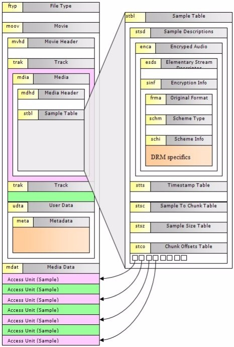

## 现在 前端也可以合成视频了

先给大家安利一下我们近期新鲜上线的 WEB 视频「编辑器」https://gaoding.com/clipper 

> 发挥你的创造力, 添加素材进行创作, 点击右上角的合成按钮, 稍侯片刻, 即可欣赏到自己创作的视频杰作了

### 视频(mp4 - h.264) 文件格式
> MP4是一种描述较为全面的容器格式，被认为可以在其中嵌入任何形式的数据，以及各种编码的音视频等，不过我们常见的大部分的MP4文件存放的AVC(H.264)或MPEG-4(Part 2)编码的视频和AAC编码的音频。
MP4的结构就像俄罗斯的套娃有很多box套box，也可以理解为一棵Box树。下面这张图是常见的box的树结构图，可以用来大致了解MP4文件的构造（内容来自https://www.cnblogs.com/boonya/p/8572052.html）

